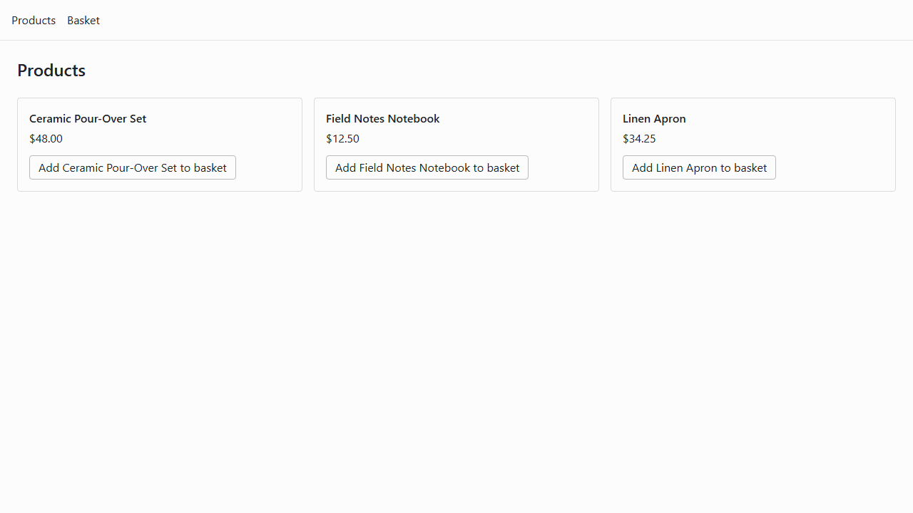
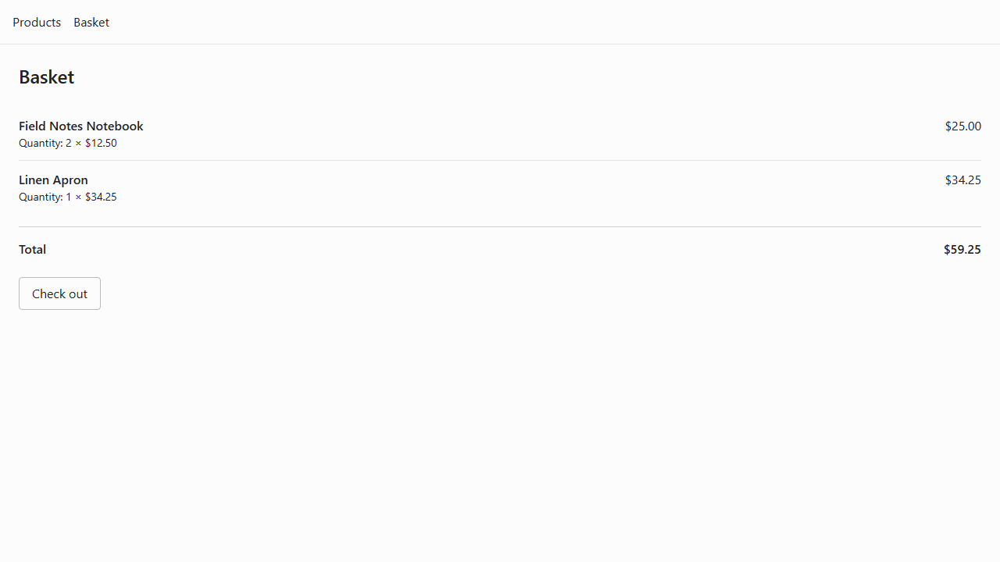
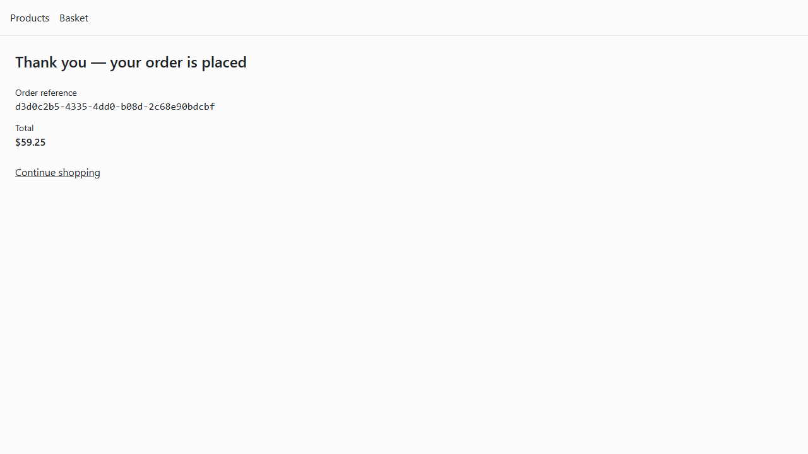
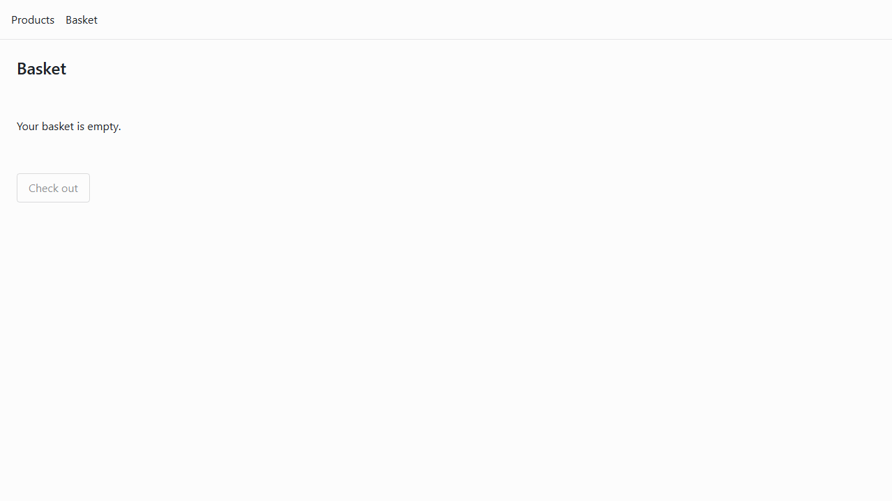

# Phase 1 demo: one order, end to end

**What this is**: the reference artifact for Phase 1's exit — the walking skeleton
([`SCRUM-5`](https://nmhieuit.atlassian.net/browse/SCRUM-5)) demonstrated by placing a real order
through the deployed stack, and the record of what that run proved.

**Story**: [`SCRUM-16`](https://nmhieuit.atlassian.net/browse/SCRUM-16) · **Spec**:
[`specs/006-e2e-order-demo/`](../specs/006-e2e-order-demo/spec.md) · **Last run**: 2026-08-19

You do not need to run anything to read this. The stills below show the whole journey. Run it
yourself if you want to see it move.

---

## Run it

```bash
cp .env.example .env      # once, if you have not already
./scripts/demo.ps1        # or ./scripts/demo.sh
```

One command. It brings the platform up in demo mode, clears the basket, drives the flow in a real
browser, reads the order back from the orders service, checks which components served the run, and
prints what it found. It exits non-zero if any part of that does not hold.

| Command | For |
|---|---|
| `./scripts/demo.ps1` · `demo.sh` | A full run, starting the stack if it is not up |
| `./scripts/demo.ps1 -SkipStart` · `demo.sh --skip-start` | A repeat run against a stack already in demo mode |

**Prerequisites**: Docker with Compose v2, Node, and the storefront's dependencies
(`pnpm install` from `frontend/`) plus Playwright's chromium
(`pnpm --filter @ecommerce/web exec playwright install chromium`). The command checks each and names
the one that is missing rather than failing obscurely.

**Starting state**: a clean basket. The command clears it for you. Order records from earlier runs
are expected to accumulate and change nothing — see [Repeatability](#repeatability).

---

## The journey

### 1. Browse

The storefront lists the seeded catalogue. Nobody loaded this data by hand: it rides the products
service's migration history, so a database created five seconds ago has it.



### 2. Basket

Two notebooks and one apron. The two notebooks are merged onto one line with a quantity, not
repeated as two lines, and the total is the catalogue's arithmetic rather than the client's.



### 3. Checkout and confirmation

The confirmation carries the order's reference and its total. The reference is the order's real
identifier, shown as-is — there is no separate order-numbering scheme in Phase 1.



### 4. The basket is empty afterwards

Which is what makes the next run start from a known state without anyone tidying up.



---

## The path a checkout takes

Narrated in the order the request travels, so the demo can be talked through without improvising:

```
browser
  └─> storefront          :4173   the container serving the built SPA
        └─> gateway       :5300   the only backend address the storefront may call
              └─> BFF             aggregates; owns no database and no business rules
                    ├─> products  the catalogue the basket priced from
                    ├─> baskets   the shopper's basket, read then emptied
                    └─> orders    creates the order and computes its total
```

Checkout is one BFF call that spans three services: read the basket, place an order for its lines,
empty the basket. The order is created **before** the basket is cleared, deliberately — a failure
between the two leaves the shopper with a real order that can be shown to them, which is
recoverable, where the reverse loses their basket with nothing to show for it.

That orchestration is not a saga and has no compensation. It is a
[recorded deviation](adr/0011-checkout-orchestration.md), closed by
[`SCRUM-18`](https://nmhieuit.atlassian.net/browse/SCRUM-18) and
[`SCRUM-31`](https://nmhieuit.atlassian.net/browse/SCRUM-31).

### How the run proves each hop served it

The demo does not just assert the diagram above. Every service exports OpenTelemetry spans, and the
run reads back which of them actually served traffic while it was happening:

```
HOPS THAT SERVED THIS RUN
  Baskets.Api    spans: 59
  Bff.Api        spans: 59
  Gateway.Api    spans: 79
  Orders.Api     spans: 24
  Products.Api   spans: 46
```

Health-check spans are excluded, and that exclusion is the whole point. Docker probes every service
every five seconds, so counting raw spans makes every component look busy on a stack where the demo
never ran. Measured on this platform: in one demo window `Parties.Api` emitted 461 spans and **all
461 were health checks**. It takes no part in checkout, and it correctly does not appear above.

What this is *not* is one request followed across all five hops by a shared identifier. The spans
already carry a correlation id, so it could be — but request-level tracing belongs to
[`SCRUM-25`](https://nmhieuit.atlassian.net/browse/SCRUM-25) and
[`SCRUM-26`](https://nmhieuit.atlassian.net/browse/SCRUM-26), and a half-built version here would be
thrown away.

---

## Tenant attribution

Phase 1 resolves a real tenant context rather than deferring it, so the demo checks that the order
actually landed under the right one. It reads the order straight from the orders service — through
that service's own API, never its database — twice:

```
TENANT ATTRIBUTION
  resolved tenant for the placing request : contoso
  tenant stored on the order              : contoso
  match                                   : YES

WITHOUT A TENANT
  GET /orders/{reference}  (no X-Tenant-Id)  ->  500, no order returned
  the orders service refuses to answer when no tenant was resolved
```

The second call is the more interesting one. A request from your machine has no gateway in front of
it to resolve a tenant, and the orders service refuses to answer rather than serving whatever a
default schema holds. That refusal is the isolation guarantee demonstrated rather than asserted.

**Being precise about what enforces what.** The tenant stored on the order is *evidence of
attribution*. What actually prevents a request reaching another tenant's data is the gate in the
orders service, which refuses to construct a database context at all without a resolved tenant.
Schema-per-tenant separation — which the constitution requires — **does not exist yet**: one
connection string serves every request. Phase 1 runs a single tenant, so nothing is currently
exposed, but this is an open gap rather than a solved problem.

---

## Repeatability

Run it again and it places a different order. The command compares against the previous run's
reference and fails if they match, because two runs reporting the same order would mean the second
one re-read the first's result instead of placing anything — and that would pass every other check
here.

```
REPEATABLE
  previous run : d6bfb638-248a-4237-8cf9-f60a1378dbf1
  this run     : f2c14b42-73b5-4d63-9876-0d3bfcff5914
  distinct     : YES
```

**Measured**: a repeat run takes **10 seconds** (budget: 90). Five consecutive runs produced five
distinct orders with no failures.

**From nothing at all**: `reset` → `up` → `demo`, wiping every volume first, reached a placed order
in **2 minutes 48 seconds** (reset 17s, up 84s, demo 67s) with no manual seeding and no repair step.
An order placed before that reset returned 404 afterwards, which is how we know the wipe was real
rather than a restart.

---

## The recording

The run records video of the whole flow. It is **not** committed — this repository has no
binary-asset convention, and a video re-recorded on every change would sit in history forever. It is
attached to [`SCRUM-16`](https://nmhieuit.atlassian.net/browse/SCRUM-16).

Locally each run leaves it at `artifacts/demo/playwright/**/video.webm`, along with the raw
verification output and the collected hop evidence. `artifacts/` is git-ignored. The stills above
are the committed evidence, and they are enough to follow the journey without it.

---

## Phase 1 exit criteria

What this run evidences, and what it deliberately does not.

| Phase 1 story | Status | Evidence |
|---|---|---|
| [`SCRUM-10`](https://nmhieuit.atlassian.net/browse/SCRUM-10) Thin slice scoped: one product, one basket, one order, one tenant | **Evidenced** | The flow above is exactly that slice |
| [`SCRUM-11`](https://nmhieuit.atlassian.net/browse/SCRUM-11) Service shells scaffolded, vertical-slice structure | **Evidenced** | Four services served this run; structure enforced by `tests/StructureConventionTests` |
| [`SCRUM-12`](https://nmhieuit.atlassian.net/browse/SCRUM-12) Stub identity with a real resolved tenant context | **Evidenced** | [Tenant attribution](#tenant-attribution) — including the refusal when none is resolved |
| [`SCRUM-13`](https://nmhieuit.atlassian.net/browse/SCRUM-13) Gateway → BFF routing | **Evidenced** | [The path a checkout takes](#the-path-a-checkout-takes); gateway and BFF both served the run |
| [`SCRUM-14`](https://nmhieuit.atlassian.net/browse/SCRUM-14) Minimal SPA: list, add, checkout, confirmation | **Evidenced** | The four stills |
| [`SCRUM-15`](https://nmhieuit.atlassian.net/browse/SCRUM-15) Whole skeleton runnable locally by one command | **Evidenced** | Cold start from wiped volumes in 2m48s |
| [`SCRUM-16`](https://nmhieuit.atlassian.net/browse/SCRUM-16) Demo: place one order end to end | **Evidenced** | This document |

### Deliberately not proved here

Phase 1's goal was "the ugliest possible version of the flow, deployed and demoable. No meaningful
test coverage or hardening yet." These are open, by design, and each belongs to a later story:

| Not proved | Why it is out of scope | Owned by |
|---|---|---|
| Schema-per-tenant data separation | Phase 1 runs one tenant; separation is a multi-service change | Unassigned — **see the note below** |
| Events, outbox, saga compensation | Nothing publishes anything yet; checkout is a synchronous orchestration | [`SCRUM-18`](https://nmhieuit.atlassian.net/browse/SCRUM-18), [`SCRUM-31`](https://nmhieuit.atlassian.net/browse/SCRUM-31) |
| Contracts generated and enforced; consumer-driven contract tests | Contracts are written but not yet the build's authority | [`SCRUM-17`](https://nmhieuit.atlassian.net/browse/SCRUM-17), [`SCRUM-21`](https://nmhieuit.atlassian.net/browse/SCRUM-21) |
| Real identity and deny-by-default authorization | A stub user and a hardcoded tenant stand in | [`SCRUM-23`](https://nmhieuit.atlassian.net/browse/SCRUM-23), [`SCRUM-24`](https://nmhieuit.atlassian.net/browse/SCRUM-24) |
| Telemetry reaching a backend; request correlation across hops | Spans reach a collector that logs them; Elastic is not stood up | [`SCRUM-25`](https://nmhieuit.atlassian.net/browse/SCRUM-25), [`SCRUM-26`](https://nmhieuit.atlassian.net/browse/SCRUM-26) |
| Performance budgets measured and enforced | No load test, no SLOs declared | [`SCRUM-29`](https://nmhieuit.atlassian.net/browse/SCRUM-29), [`SCRUM-32`](https://nmhieuit.atlassian.net/browse/SCRUM-32) |
| This demo gating the build | It is run by a person, not a pipeline | [`SCRUM-22`](https://nmhieuit.atlassian.net/browse/SCRUM-22) |
| Deployment to Kubernetes | Phase 1 demonstrates the local stack | Phase 6 |

**The one that has no owner.** Schema-per-tenant separation is required by the constitution
(Principle V) and does not exist. It was recorded as a gap by specs 004 and 005 and is recorded
again here. Nothing is currently exposed, because there is one tenant — but the first day there are
two, this becomes a data-isolation defect rather than a tidiness one. It needs a story.

---

## If it fails

The command names what went wrong rather than dumping a stack trace. The most common causes:

| Symptom | Cause |
|---|---|
| "the stack is not running in demo mode" | `-SkipStart` against a stack started with `up`. Drop the flag |
| "the demo must start from a clean basket" | The spec was run directly instead of through the command |
| "Hop evidence is incomplete" | A component served nothing. The stack is up but the flow did not reach it |
| A step times out | The stack is up but not warm. The command warms it; a cold first call can exceed the BFF's downstream budget |

The video and a Playwright trace for the failing run are written to `artifacts/demo/`. Open the
trace with `npx playwright show-trace <path>` to step through it.
